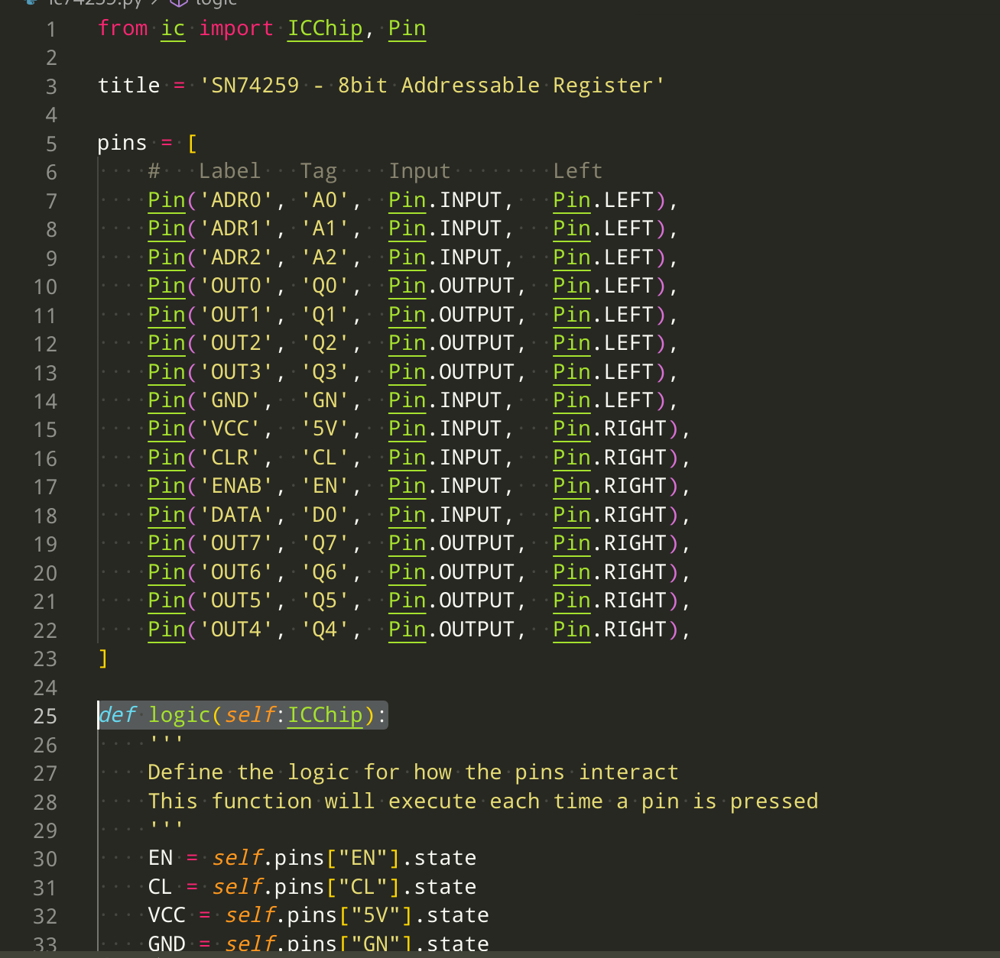
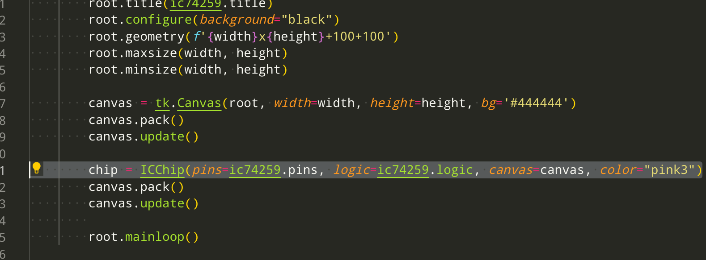
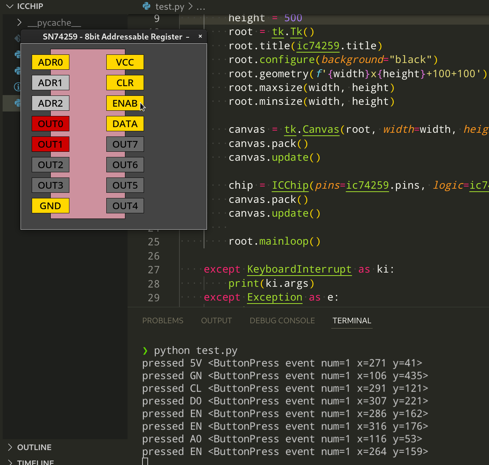

# icchip
Python IC simulation with tkinter

Create an IC Chip with custom inputs/outputs and logic


## 1. Define your title, pins and logic function


Refer to the following properties when writing your logic:

```arm
ICChip Properties:
    pins:dict[_icpin] - A Dictionary of pins indexed by Tag (not by Label)
    
Pin Properties:
    state:bool - True if HIGH, False if LOW
    on:method - turns the pin HIGH
    off:method - turns the pin LOW
    toggle:method - toggles pin from HIGH to LOW or LOW to HIGH
```

## 2. Pass your pins and logic to an ICChip along with a tkinter.Canvas


## 3. Run your code

